# CareMyCar iOS

CareMyCar iOS is a SwiftUI mobile application for vehicle ownership, maintenance tracking, service order management, parts marketplace workflows, and agency/admin operations. The project is built as a professional iOS portfolio sample with Clean Architecture, dependency injection, reusable UI components, and REST API integration.

## 1. Description

CareMyCar centralizes the most common workflows around vehicle care:

- Clients can manage their vehicles, track maintenance, request service orders, buy parts, and estimate monthly ownership costs.
- Agencies/admin users can manage parts inventory, sales orders, service orders, PDF reports, and operational workflows.

The app uses a clean, native iOS interface built with SwiftUI, SF Symbols, grouped surfaces, role-based navigation, and reusable visual states.

## 2. Objective

The goal of this project is to demonstrate a production-minded iOS application suitable for a developer portfolio. It focuses on:

- Professional SwiftUI implementation
- Clean Architecture separation
- Maintainable networking and data flow
- Secure session handling with Keychain
- Scalable feature organization
- Real backend integration
- App Store-oriented UX patterns

## 3. Features

- Email/password authentication
- Role-based navigation for client and agency/admin users
- Vehicle list, detail, creation, deletion, and mileage update
- Maintenance history and recommendations
- Service order creation, quoting, status management, and PDF reporting
- Parts marketplace with product and purchase flows
- Admin catalog management for parts
- Admin sales dashboard and daily sales report PDF export
- Monthly ownership cost calculator
- Keychain-backed session persistence
- Automatic session cleanup on `401 Unauthorized`
- Shared loading, empty, error, and success UI patterns

## 4. Technologies

- Swift
- SwiftUI
- iOS 18+
- Xcode
- async/await
- URLSession
- Keychain Services
- REST APIs
- SF Symbols
- Clean Architecture
- Dependency Injection
- Git / GitHub

## 5. Architecture

The project follows Clean Architecture principles with explicit boundaries between presentation, domain, data, and shared core infrastructure.

```text
CareMyCariOS
├── App
├── Core
│   ├── DI
│   ├── DesignSystem
│   ├── Networking
│   ├── Presentation
│   ├── Security
│   └── Session
├── Domain
│   ├── Repositories
│   └── UseCases
├── Data
│   └── Repositories
├── Features
│   ├── Admin
│   ├── Auth
│   ├── Home
│   ├── Maintenance
│   ├── Marketplace
│   ├── ServiceOrders
│   ├── Tools
│   └── Vehicles
└── Models
```

### Layer Responsibilities

- **Presentation / Features:** SwiftUI screens, navigation, user interaction, and visual state.
- **Domain:** Repository contracts and use cases consumed by the UI.
- **Data:** API-backed repository implementations using `APIClient`.
- **Core:** Shared infrastructure such as networking, Keychain, session state, design system, and dependency composition.

`AppDependencies` acts as the composition root. It wires concrete API repositories into domain use cases and exposes them through the SwiftUI environment.

## 6. Screenshots

### Authentication

| Login |
|---|
| 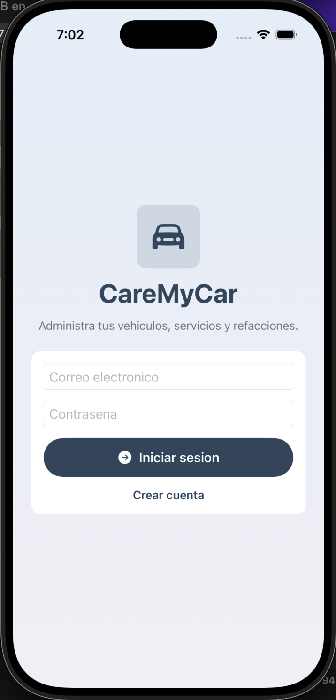 |

### Agency / Admin

| Dashboard | Catalog | Sales |
|---|---|---|
| 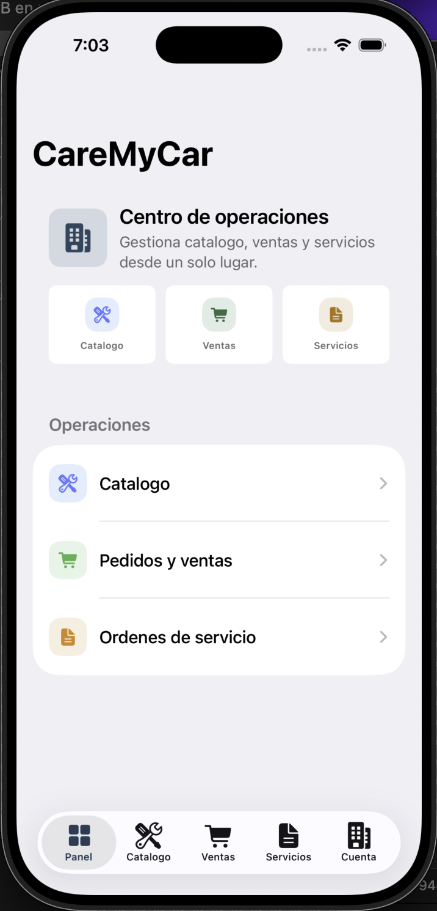 | 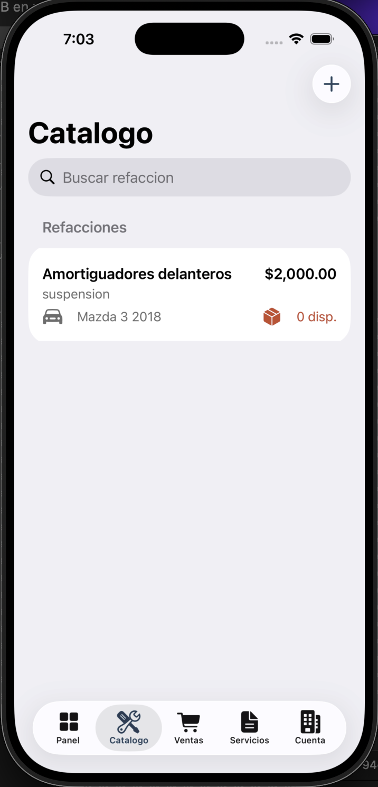 | 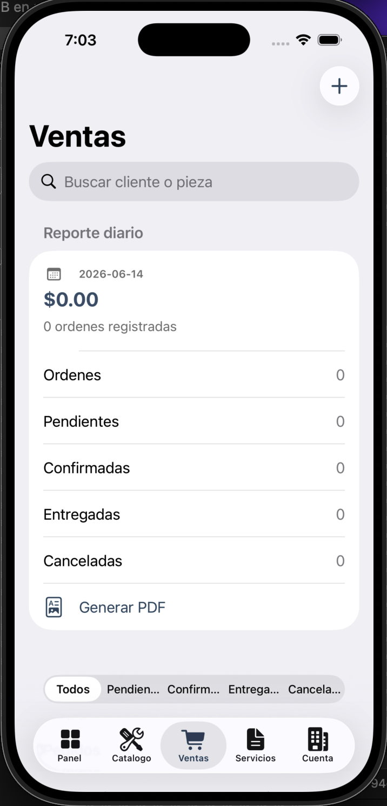 |

| Service Orders | Admin Account |
|---|---|
| 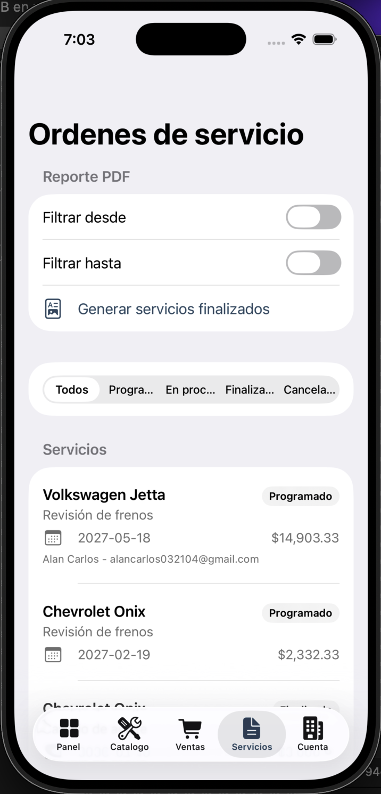 | 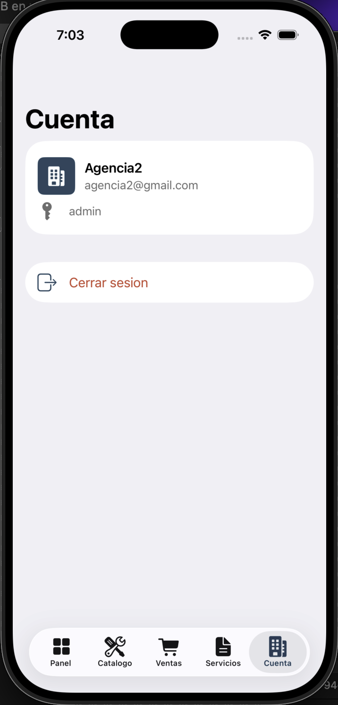 |

### Client

| Vehicles | Vehicle Detail | Vehicle Actions |
|---|---|---|
| 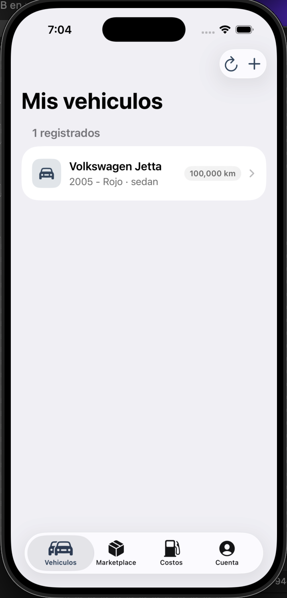 | 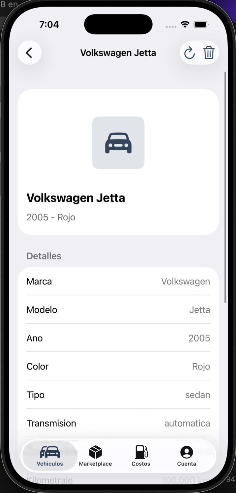 | 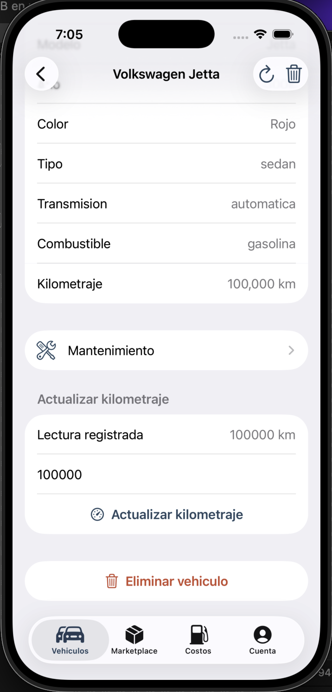 |

| Marketplace | Monthly Cost | Client Account |
|---|---|---|
| 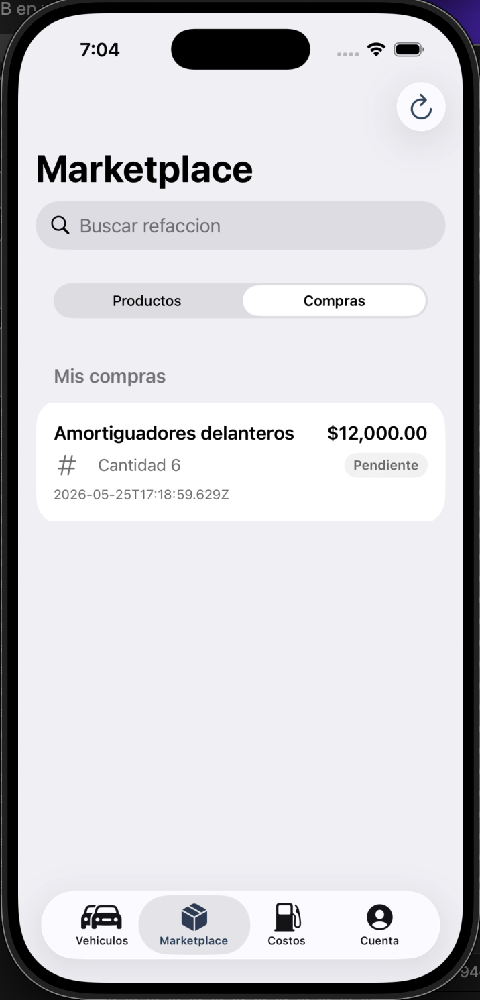 | 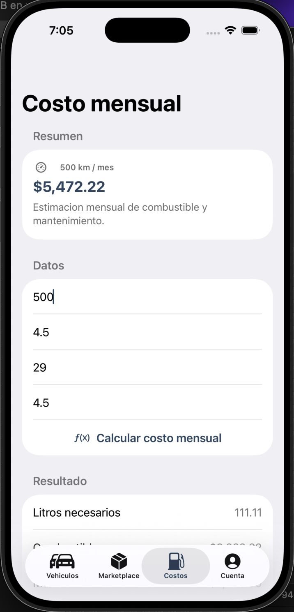 | 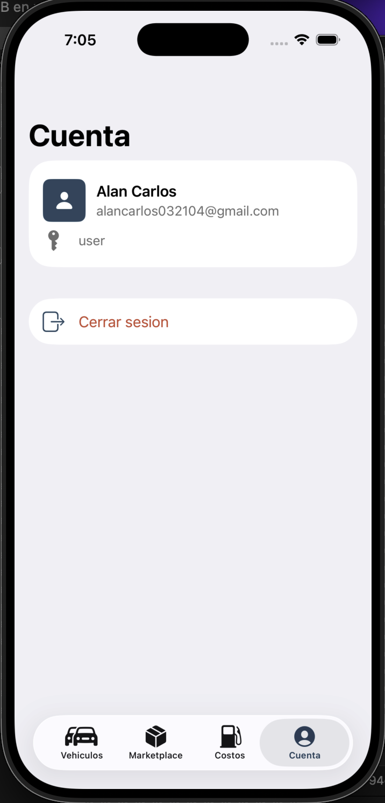 |

## 7. API Integration

The app integrates with a REST API through a reusable `APIClient` built with `URLSession` and `async/await`.

Current base URL:

```text
https://caremycarapi-node.onrender.com/
```

The base URL is configured in:

```text
CareMyCariOS/Config/AppConfig.swift
```

API responsibilities include:

- Auth login/register
- Vehicle management
- Maintenance history
- Service orders and quotes
- Parts catalog and marketplace purchases
- Admin sales and service order reports
- PDF data responses for sharing/export

## 8. Authentication

Authentication is handled through the backend API using email and password credentials.

Security/session flow:

- Access tokens are stored in Keychain using `KeychainTokenStore`.
- The app restores the session on launch through `SessionStore`.
- Authenticated requests use Bearer token authorization.
- When the API returns `401 Unauthorized`, the token is cleared and the user is signed out.

## 9. How to Run

### Requirements

- Xcode 26.5 or newer
- iOS 18.0 or newer
- Swift 5

### Run in Xcode

1. Clone the repository.
2. Open `CareMyCariOS.xcodeproj`.
3. Select the `CareMyCariOS` scheme.
4. Run on an iOS Simulator or physical device.

### Command-Line Build

```sh
xcodebuild -project CareMyCariOS.xcodeproj \
  -scheme CareMyCariOS \
  -configuration Debug \
  -destination generic/platform=iOS \
  CODE_SIGNING_ALLOWED=NO \
  build
```

## 10. Status / Roadmap

### Current Status

- Functional SwiftUI application
- Clean Architecture migration completed
- API repositories and domain use cases implemented
- Dependency injection configured through SwiftUI environment
- Keychain authentication flow implemented
- Screenshots and documentation prepared for portfolio presentation

### Roadmap

- Add feature-level ViewModels for heavier screens
- Split DTOs and domain entities into stricter model boundaries
- Add unit tests for use cases and repositories
- Add UI tests for critical flows
- Improve localization and Spanish accent consistency
- Add app icon polish and launch screen assets
- Add preview/mock dependencies for SwiftUI previews
- Add analytics/crash reporting abstraction

## 11. Author

**Alan Carlos Hernandez**

- GitHub: [@alancarlosh](https://github.com/alancarlosh)
- Project repository: [CareMyCariOS](https://github.com/alancarlosh/CareMyCariOS)

